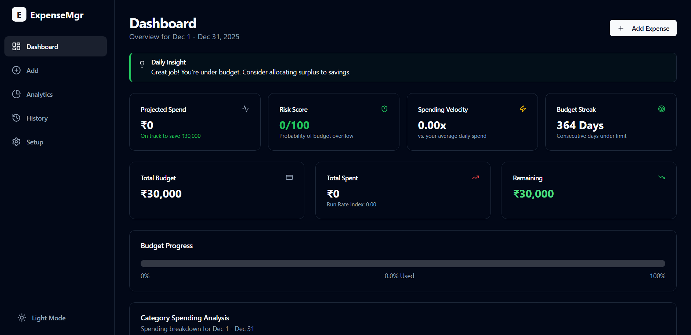

# Money Manager

A modern, client-side personal finance management application designed to help you track your expenses, manage budgets, and gain insights into your spending habits.

## ✨ Key Features

-   **Expense Tracking**: Easily add, edit, and delete your daily expenses.
-   **Budget Management**: Set a total monthly budget and individual budgets for each category.
-   **Custom Categories**: Create and manage your own expense categories.
-   **Interactive Dashboard**: Get a quick overview of your finances, including key metrics and recent activity.
-   **Advanced Analytics**:
    -   **Spending Forecast**: Predicts your total spending by the end of the month based on current habits.
    -   **Spending Velocity**: Monitors the rate of your spending.
    -   **Budget Risk Score**: Assesses the likelihood of you exceeding your budget.
    -   **AI-Powered Insights**: Receive intelligent recommendations to improve your financial habits.
-   **Historical View**: Browse and filter your complete expense history.
-   **Theme Support**: Switch between light and dark modes for comfortable viewing.
-   **Local Storage**: All your data is stored securely in your browser—no need for an account.

## 🚀 Tech Stack

-   **Framework**: React 19
-   **Build Tool**: Vite
-   **Routing**: React Router
-   **Styling**: Tailwind CSS
-   **UI Components**: shadcn/ui, Radix UI, Recharts
-   **State Management**: React Context API
-   **Date & Time**: Day.js
-   **Testing**: Vitest, React Testing Library

## 🏁 Getting Started

Follow these instructions to get a copy of the project up and running on your local machine.

### Prerequisites

-   [Node.js](https://nodejs.org/) (v18 or newer recommended)
-   [npm](https://www.npmjs.com/)

### Installation

1.  Clone the repository to your local machine:
    ```sh
    git clone https://github.com/your-username/Money-mgr.git
    ```
2.  Navigate into the project directory:
    ```sh
    cd Money-mgr
    ```
3.  Install the required dependencies:
    ```sh
    npm install
    ```

## 🏃‍♀️ Usage

To start the development server and run the application, use the following command:

```sh
npm run dev
```

The application will be available at `http://localhost:5173` (or the next available port).

### Other Scripts

-   **Build for Production**:
    ```sh
    npm run build
    ```
-   **Lint Files**:
    ```sh
    npm run lint
    ```
-   **Run Tests**:
    ```sh
    npm run test
    ```
-   **Preview Production Build**:
    ```sh
    npm run preview
    ```